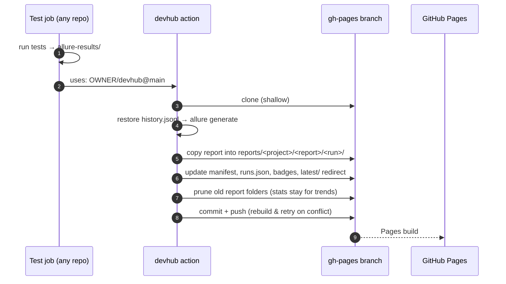
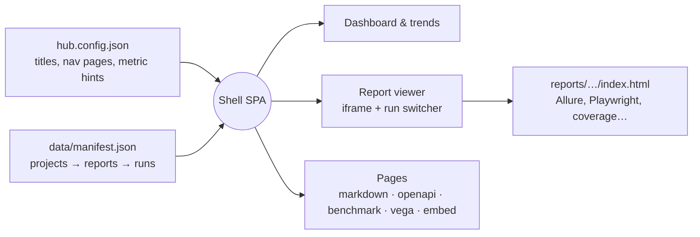

# How Dev Hub works

Dev Hub is a static site. There is no server and no database: GitHub Pages serves a
small single-page app (the *shell*) plus whatever reports CI has published next to it.

## The two halves

| | Lives on | Updated by | Contains |
|---|---|---|---|
| **Shell** | `main` → `site/` (Preact + TypeScript, built by Vite into `dist/`) | `deploy-site.yml` on every push to `main` | `index.html`, `assets/`, `hub.config.json`, `docs/` |
| **Content** | `gh-pages` only | the devhub action, from any repo's CI | `reports/`, `data/manifest.json`, `data/runs.json`, `data/badges/` |

The deploy workflow builds the shell and copies `dist/` into `gh-pages` without touching
published content, and publishing never touches the shell — so both can run at any time.

## Publishing flow



## What the shell reads



## Layout of the Pages branch

```text
gh-pages/
├── index.html, assets/, docs/, hub.config.json   ← shell (synced from main)
├── data/
│   ├── manifest.json            ← every project, report channel and run
│   ├── runs.json                ← same runs, flattened for custom charts
│   └── badges/<project>/<report>.json   ← shields.io endpoint badges
└── reports/<project>/<report>/
    ├── history.jsonl            ← Allure 3 history, restored before each generate
    ├── latest/index.html        ← redirect to the newest run
    ├── 142/                     ← one folder per run (last N kept)
    └── 143/
```

## Why iframes?

Each report is a self-contained static site with its own router, styles and scripts.
Embedding it in a same-origin iframe keeps it untouched while the shell adds navigation
around it. Because the origin is shared, the shell can also:

- mirror the report's inner location into the URL (`?at=…`), so a link to a specific
  Allure test page opens that exact test inside the hub,
- share the light/dark theme with Allure 3 (both use the `theme` localStorage key),
- keep <kbd>⌘K</kbd> working while focus is inside the report.
